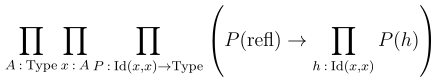
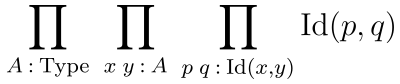

# Inconsistency between Univalence and Axiom K 
This repository demonstrates that having both Axiom K and Univalence leads to inconsistency. The proof is done in `Agda` with `cubical` library.

## Axiom K 
Axiom K is formulated as following:



Or, in Agda we will define it as follows:
```
AxiomK : Typeω
AxiomK = {u : Level} {A : Type u} {x : A} → (P : x ≡ x → Type u) → P refl → (h : x ≡ x) → P h
```

It allows to perform pattern-matching on Identity types by asserting that each term of identity type `Id(x, x)` is propositionally equal to reflexivity proof `refl`. 

Another important statement is Uniqueness of Identity Proof (Axiom UIP)



Which in Agda translates to:
```
AxiomUIP : Typeω
AxiomUIP = {u : Level} {A : Type u} {x y : A} → (p q : x ≡ y) → p ≡ q
```

Axiom UIP and Axiom K are logically equivalent, and we can derive one from the other:
```
K→UIP : AxiomK → AxiomUIP
K→UIP K {u} {A} {x} = J (λ y₁ p' → ((q' : x ≡ y₁) → p' ≡ q')) (K (λ q → refl ≡ q) refl)

UIP→K : AxiomUIP → AxiomK
UIP→K UIP P onRefl h = subst P (UIP refl h) onRefl
```

## Univalence
For types `A` and `B`, there is a canonically defined path from identity type `Id(A, B)` to isomorphism `A → B`:
```
pathToIso : {A B : Type} → A ≡ B → A ≅ B
pathToIso {A} {B} p = J (λ y _ → A ≅ y) iso' p where

    iso' : {A : Type} → A ≅ A
    iso' = iso (λ x → x) (λ x → x) (λ b → refl) λ a → refl
```

Univalence states that there is mapping `isoToPath` of form
```
isoToPath : {A B : Type} → A ≅ B → A ≡ B
```

Moreover, together with `pathToIso` this mapping forms an isomorphism `(A ≅ B) ≅ (A ≡ B)`.

## Idea of univalence and UIP incompatibility
UIP states that any two identity proofs are themselves equal. However, when working with univalence, identity proofs correspond to isomorphisms of types. Obviously, there could be several different isomorphisms and, since the univalence is isomorphism itself, corresponding identity proofs must not be equal. In proof below we will assume Axiom K, use UIP to derive equality of said identity proofs, and show that we can derive value of type `⊥`, and that is clearly absurd.

## Proof
Our goal would be to construct a proof of the statement
```
K→⊥ : AxiomK → ⊥
```

We will work with the type `Bool`: clearly, it is equal to itself. Actually, with univalence we can construct two different equalities.

First equality is obtained by reflexivity:
```
idPath : Bool ≡ Bool
idPath = refl
```

The second one could be obtained via univalence from the isomorphism that sends `true` to `false` and `false` to `true`:
```
flip : Bool → Bool
flip false = true
flip true = false

flipIso : Bool ≅ Bool
flipIso = iso flip flip rightInv leftInv where

    rightInv : section flip flip
    rightInv false = refl
    rightInv true = refl

    leftInv : retract flip flip
    leftInv false = refl
    leftInv true = refl

flipPath : Bool ≡ Bool
flipPath = isoToPath flipIso
```

Assuming Axiom K, we can obtain UIP and conclude that `idPath` is equal to `flipPath`:
```
K→idPath≡flipPath : AxiomK → idPath ≡ flipPath
K→idPath≡flipPath K = K→UIP K idPath flipPath
```

Now we can follow along each path in equality, starting from true, to derive the fact that `true` equals `false`:
```
K→true≡false : AxiomK → true ≡ false
K→true≡false K = cong (λ path → transport path true) (K→idPath≡flipPath K)
```

This is clearly absurd, and to derive `⊥`, we would construct a nontrivial subsingleton bundle over `Bool`:
```
boolBundle : Bool → Type
boolBundle false = ⊥
boolBundle true = ⊤
```

Finally, `subst` allows us to follow along the path `true ≡ false` in the bundle, and produce an inhabitant of `⊥` from an inhabitant of `⊤`:

```
K→⊥ : AxiomK → ⊥
K→⊥ K = subst boolBundle (K→true≡false K) tt
```
Hence, we've shown that assuming Axiom K leads to inconsistency, q. e. d.

## Thank you for your attention!
